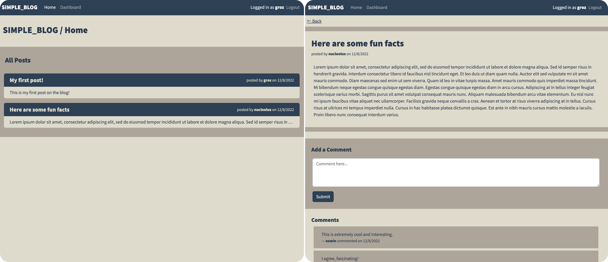

# Simple Blog

## Description

A full-stack web application that employs Node.js/Express, Sequelize, and Handlebars to render and manage a simple web blog. The project includes the following features in accordance with the challenge guidelines:
- Proper setup of the `.gitignore` file to prevent `node_modules`, `.env`, and other extraneous system files from being tracked.
- Use of the **dotenv** package to read database credentials and cookie params into the environment from a `.env` file.
- Use of the **MySQL 2** and **Sequelize** packages to establish a connection to a local MySQL database and perform operations.
- Use of Sequelize **models** and **associations** for users, posts, and comments.
- Use of **modular routing** to compartmentalize endpoints.
- Use of the **express-session** and **bcrypt** packages, and **custom middeware** functions to support user authentication and authorization.
- Use of the **connect-session-sequelize** package to store user sessions in the database.
- Use of Sequelize model methods at appropriate endpoints to perform **CRUD operations** on posts and comments.
- Use of the **Handlebars** template engine to dynamically render page views.
- Strong adherence to the **MVC paradigm** in project layout/design.

&nbsp;

## Usage

### Heroku Deployment
A deployed instance of the app is available [here on Heroku](https://simple-blog.herokuapp.com/).

### Usage instructions
- The app `homepage` shows a list of all blog posts contributed by users. Click on a post title to view the entire post and its associated comments.
- Click the `login` link in the navbar to login/sign up as a new user of the site. Follow the instructions on screen to provide or define a username and password. Upon successful login or signup, you will be directed to the homepage.
- Once authenticated, you may add comments when viewing a post. You may also edit and delete any comments you've authored while viewing a post.
- Once authenticated, you may also access your user `dashboard`, where you can create, view, edit, and delete blog posts.
- To end your authenticated session, choose `logout` from the navbar.

## Credits

General acceptance criteria for the project were prescribed by the UofM Coding Bootcamp (Trilogy Education Services); all code was written by the developer.

## License

Please refer to the LICENSE in the repo.